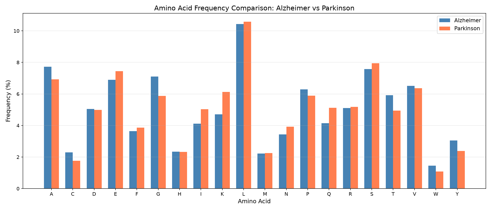

# Protein Scraper: Amino Acid Frequencies in Alzheimer's and Parkinson's Proteins

A small Python tool that pulls reviewed human proteins associated with a disease from the [UniProt REST API](https://rest.uniprot.org), counts the amino acids across their sequences, and visualizes how the composition compares between diseases.

By default it compares **Alzheimer's** and **Parkinson's** disease, but the pipeline works for any UniProt disease keyword.

## What it does

1. **Fetches** reviewed (Swiss-Prot) human proteins tagged with a disease keyword.
2. **Extracts** each protein's accession, name, and amino acid sequence.
3. **Counts** every residue across all sequences and converts counts to percentage frequencies.
4. **Saves** results as JSON.
5. **Plots** a bar chart per disease and a side-by-side comparison chart.

## Quick start

```bash
# 1. Clone the repo
git clone https://github.com/gds-workshop/protein-scraper.git
cd protein-scraper

# 2. (Recommended) create a virtual environment
python -m venv venv
source venv/bin/activate        # Windows: venv\Scripts\activate

# 3. Install dependencies
pip install -r requirements.txt

# 4. Run
python protein_scraper.py
```

An internet connection is required, since data is fetched live from UniProt.

## Output

Running the script produces:

| File | Description |
|------|-------------|
| `alzheimer_amino_acid_frequencies.json` | Frequencies, protein list, and residue totals for Alzheimer's |
| `parkinson_amino_acid_frequencies.json` | Same for Parkinson's |
| `alzheimer_amino_acid_chart.png` | Bar chart of Alzheimer's amino acid frequencies |
| `parkinson_amino_acid_chart.png` | Bar chart of Parkinson's amino acid frequencies |
| `disease_comparison_chart.png` | Grouped bar chart comparing the two diseases |

Charts are also displayed in a window via `plt.show()`.

### JSON format

```json
{
  "disease": "Alzheimer",
  "protein_count": 19,
  "total_residues": 12880,
  "frequencies": { "A": 7.72, "C": 2.3, "...": "..." },
  "proteins": [
    { "accession": "P02649", "name": "Apolipoprotein E", "length": 317 }
  ]
}
```

## Sample results

| Dataset | Proteins | Total residues |
|---------|----------|----------------|
| Alzheimer | 19 | 12,880 |
| Parkinson | 25 | 21,584 |

Leucine (L) is the most abundant residue in both sets (about 10.4% and 10.6%). A few of the larger differences:

| Amino acid | Alzheimer (%) | Parkinson (%) |
|------------|---------------|---------------|
| Glycine (G) | 7.11 | 5.87 |
| Alanine (A) | 7.72 | 6.93 |
| Lysine (K) | 4.70 | 6.12 |
| Isoleucine (I) | 4.12 | 5.03 |
| Glutamine (Q) | 4.15 | 5.12 |

<!-- Once you commit the generated charts, uncomment these:

-->

> **Interpretation caveat:** these are small gene sets, and frequencies are pooled across all residues, so long proteins dominate (for example, VPS13C contributes 3,753 of Parkinson's 21,584 residues). Treat the numbers as an exploratory comparison, not a statistical finding.

## Customizing

To analyze a different disease, edit `main()` in `protein_scraper.py`:

```python
data = analyze_disease("Diabetes", max_results=50)
```

The `disease_keyword` is passed to UniProt as a [keyword query](https://www.uniprot.org/keywords), so it should match a UniProt keyword (for example `Alzheimer`, `Parkinson`, `Epilepsy`).

Key functions:

- `fetch_proteins(disease_keyword, max_results)`: queries UniProt for reviewed human proteins (`organism_id:9606`).
- `extract_sequences(proteins)`: pulls accession, name, and sequence; skips entries with missing fields.
- `count_amino_acids(sequences)` / `calculate_frequencies(counts, total)`: compute residue counts and percentages.
- `create_bar_chart(...)` / `create_comparison_chart(...)`: generate the plots.

## Notes and limitations

- **Fewer results than requested.** The query asks for up to 25 proteins, but entries without a `recommendedName` are skipped (a message is printed), which is why Alzheimer's yields 19 proteins.
- **Overlap between diseases.** Alpha-synuclein (P37840) appears in both datasets.
- **Results may change.** UniProt is updated regularly, so re-running the script can return different proteins and frequencies.
- `alzheimer_sequences.json` in this repo contains the raw sequences for the Alzheimer's set; the current script does not write this file.

## Project structure

```
.
├── protein_scraper.py                       # Main script
├── requirements.txt                         # Python dependencies
├── alzheimer_amino_acid_frequencies.json    # Output: Alzheimer's results
├── parkinson_amino_acid_frequencies.json    # Output: Parkinson's results
├── alzheimer_sequences.json                 # Raw Alzheimer's sequences
├── LICENSE
└── .gitignore
```

## Requirements

- Python 3.8+
- [requests](https://pypi.org/project/requests/) 2.34.2
- [matplotlib](https://pypi.org/project/matplotlib/) 3.11.1

## Data source

Protein data comes from [UniProt](https://www.uniprot.org/) (UniProtKB/Swiss-Prot). If you use results from this project, please cite UniProt: The UniProt Consortium, *Nucleic Acids Research*.

## License

Released under the [MIT License](LICENSE).
